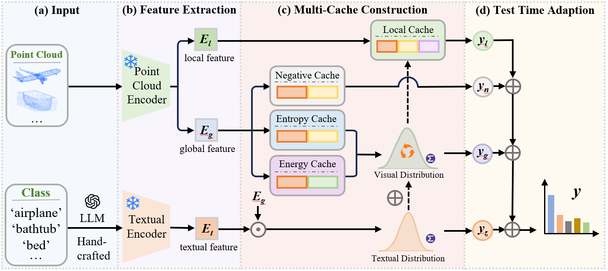

# EEMF

Entropy-Energy-Driven Multi-Cache Framework for robust zero-shot point cloud recognition.

## Overview

Recent 3D Vision-Language Foundation Models (3D VLFMs) have advanced open-vocabulary point cloud recognition, but their zero-shot recognition performance can still degrade substantially under distribution shifts. EEMF is a training-free point cloud test-time adaptation framework that integrates distribution constraints into online cache construction and inference.

EEMF keeps the 3D VLFM backbone frozen. During test-time inference, it selects reliable prototypes with prediction entropy and energy, maintains complementary positive and negative caches, constrains local-cache updates with textual and visual distributions, and fuses cache predictions with zero-shot predictions for final inference. The method does not require source data, target labels, backpropagation, or model parameter updates.

The current release supports four 3D VLFM backbones:

- ULIP
- ULIP-2
- OpenShape
- Uni3D

The current release evaluates four datasets:

- ModelNet
- ModelNet-C
- ScanObjectNN
- ScanObjectNN-C

## Method at a Glance

EEMF contains four online caches:

| Cache | Capacity | Role |
| --- | ---: | --- |
| Entropy cache | 3 per predicted class | Keeps globally reliable low-entropy prototypes. |
| Energy cache | 3 per predicted class | Keeps globally reliable low-energy prototypes and supports visual distribution estimation. |
| Local cache | 3 per predicted class | Keeps local patch-level prototypes constrained by visual-textual distribution quality. |
| Negative cache | 6 per predicted class | Stores uncertain samples to suppress confusing classes. |

The released setting uses the fixed final-score composition:

~~~text
logits = zero_shot_logits
       + 4.0  * entropy_cache_logits
       + 3.5  * local_cache_logits
       - 0.14 * negative_cache_logits
~~~

The textual distribution term is weighted by 0.15 when computing the joint distribution quality used for local-cache updates. Positive-cache affinity sharpness is set to 3.0, and negative-cache affinity sharpness is set to 1.0.

## Reproduction

All commands below should be executed from the project root.

Recommended workflow:

~~~bash
conda env create -f environment.yml
conda activate eemf

# Prepare datasets under data/.
# Prepare pre-trained backbone weights under weights/.

bash scripts/run_eemf_all.sh 0
~~~

Here 0 is the physical GPU index. The released scripts use relative paths and write outputs to <code>results/</code>.

### 1. Environment

The recommended environment name is <code>eemf</code>:

~~~bash
conda env create -f environment.yml
conda activate eemf
~~~

If you already have a compatible Conda environment, you can install the pip package list manually:

~~~bash
conda create -n eemf python=3.9 -y
conda activate eemf
pip install -r requirements.txt
~~~

Main runtime versions used by the released experiments include:

- Python 3.9
- PyTorch 1.12.0
- CUDA 11.6
- torchvision 0.13.0
- timm 0.9.16
- open-clip-torch 2.24.0

### 2. Datasets

EEMF uses ModelNet, ModelNet-C, ScanObjectNN, and ScanObjectNN-C. The clean splits are stored together with their corrupted counterparts:

- ModelNet: <code>data/modelnet_c/clean.h5</code>
- ScanObjectNN: <code>data/sonn_c/hardest/clean.h5</code>

Download the datasets from the official benchmark repositories and place them under <code>data/</code>:

| Dataset | Link | Local path |
| --- | --- | --- |
| ModelNet / ModelNet-C | [Point-PRC modelnet_c](https://huggingface.co/datasets/auniquesun/Point-PRC/tree/main/new-3ddg-benchmarks/xset/corruption/modelnet_c) | <code>data/modelnet_c/</code> |
| ScanObjectNN / ScanObjectNN-C | [Point-PRC sonn_c](https://huggingface.co/datasets/auniquesun/Point-PRC/tree/main/new-3ddg-benchmarks/xset/corruption/sonn_c) | <code>data/sonn_c/</code> |

The expected dataset layout is:

~~~text
EEMF/
  data/
    modelnet_c/
      shape_names.txt
      shape_names_openshape.txt
      clean.h5
      add_global_0.h5
      add_global_1.h5
      ...
      scale_4.h5
    sonn_c/
      shape_names.txt
      hardest/
        clean.h5
        add_global_0.h5
        add_global_1.h5
        ...
        scale_4.h5
~~~

ModelNet-C and ScanObjectNN-C contain seven corruption families:

~~~text
add_global, add_local, dropout_global, dropout_local, rotate, scale, jitter
~~~

Each corruption family has five severity levels, indexed from 0 to 4. The full corrupted evaluation therefore contains 35 streams. In this release, ScanObjectNN and ScanObjectNN-C use the hardest split.

### 3. Pre-Trained Weights

Place all backbone weights under <code>weights/</code>. The default paths used by the scripts are:

| Backbone | Required files |
| --- | --- |
| ULIP | <code>weights/ulip/slip_base_100ep.pt</code>, <code>weights/ulip/pointbert_ulip1.pt</code> |
| ULIP-2 | <code>weights/ulip/slip_base_100ep.pt</code>, <code>weights/ulip/pointbert_ulip2.pt</code> |
| OpenShape | <code>weights/openshape/open_clip_pytorch_model/vit-bigG-14/laion2b_s39b_b160k.bin</code>, <code>weights/openshape/openshape-pointbert-vitg14-rgb/model.pt</code> |
| Uni3D | <code>weights/uni3d/open_clip_pytorch_model/laion2b_s9b_b144k.bin</code>, <code>weights/uni3d/modelnet40/model.pt</code>, <code>weights/uni3d/scanobjnn/model.pt</code> |

Official sources:

- [ULIP / ULIP-2 weights](https://huggingface.co/datasets/auniquesun/Point-PRC/tree/main/pretrained-weights/ulip)
- [OpenShape pointbert-vitg14-rgb](https://huggingface.co/OpenShape/openshape-pointbert-vitg14-rgb)
- [CLIP ViT-bigG-14 text encoder](https://huggingface.co/laion/CLIP-ViT-bigG-14-laion2B-39B-b160k)
- [Uni3D model zoo](https://huggingface.co/BAAI/Uni3D/tree/main/modelzoo/uni3d-g)
- [EVA02 text encoder for Uni3D](https://huggingface.co/timm/eva02_enormous_patch14_plus_clip_224.laion2b_s9b_b144k)

OpenShape and Uni3D weights can be downloaded with the provided scripts:

~~~bash
python weights/download_openshape_weights.py --variant vitg14
python weights/download_uni3d_weights.py --with-task-ckpts
~~~

ULIP and ULIP-2 weights should be downloaded from the official link above and placed under the default ULIP paths.

### 4. Text Prompts and Optional LLM Configuration

The default EEMF setting uses handcrafted prompts for zero-shot inference and cached LLM-enhanced class descriptions for textual distribution modeling. The cached prompt files are expected under <code>llm/</code>:

~~~text
llm/
  modelnet_c_deepseek_deepseek-v4-pro_multiview_2d3d_10_prompts.json
  sonn_c_deepseek_deepseek-v4-pro_multiview_2d3d_10_prompts.json
~~~

If these JSON files already exist, no API key is required for normal reproduction.

Only when regenerating LLM prompts, create a <code>.env</code> file in the project root:

~~~text
LLM_API_KEY=sk-xxx
LLM_PROVIDER=deepseek
LLM_MODEL=deepseek-v4-pro
LLM_API_BASE_URL=https://api.deepseek.com/chat/completions
LLM_TEMPERATURE=0.3
~~~

Then run <code>python -m eemf.run</code> with <code>--force-regenerate-prompts</code> or a custom prompt-cache setting. The code loads <code>.env</code> through <code>python-dotenv</code>.

### 5. Running EEMF

Run one backbone on one dataset:

~~~bash
bash scripts/run_eemf.sh BACKBONE DATASET [GPU] [SEVERITY]
~~~

Arguments:

| Argument | Values | Meaning |
| --- | --- | --- |
| <code>BACKBONE</code> | <code>ulip</code>, <code>ulip2</code>, <code>openshape</code>, <code>uni3d</code> | 3D VLFM backbone. |
| <code>DATASET</code> | <code>modelnet</code>, <code>scanobjnn</code>, <code>modelnet_c</code>, <code>scanobjnn_c</code> | Evaluation dataset. |
| <code>GPU</code> | integer GPU id | Physical GPU index. Defaults to 0 or <code>EEMF_GPU</code>. |
| <code>SEVERITY</code> | <code>0</code>, <code>1</code>, <code>2</code>, <code>3</code>, <code>4</code>, <code>all</code> | Optional; only valid for corrupted datasets. |

Examples:

~~~bash
# Clean ModelNet with ULIP.
bash scripts/run_eemf.sh ulip modelnet 0

# Clean ScanObjectNN hardest split with OpenShape.
bash scripts/run_eemf.sh openshape scanobjnn 0

# ModelNet-C full all35 evaluation with ULIP-2.
bash scripts/run_eemf.sh ulip2 modelnet_c 0

# ScanObjectNN-C full all35 evaluation with Uni3D.
bash scripts/run_eemf.sh uni3d scanobjnn_c 0 all

# ModelNet-C severity level 2 only: all seven corruption families at level 2.
bash scripts/run_eemf.sh ulip modelnet_c 0 2
~~~

For corrupted datasets, omitting <code>SEVERITY</code> or passing <code>all</code> runs all 35 streams. Passing a severity level runs all seven corruption families at that level. The released entry does not take an individual corruption name as an argument.

Run multiple backbones and datasets:

~~~bash
bash scripts/run_eemf_all.sh [GPU] [BACKBONES] [DATASETS]
~~~

Examples:

~~~bash
# Run all four backbones on all four datasets.
bash scripts/run_eemf_all.sh 0

# Run ULIP and ULIP-2 on ModelNet-C and ScanObjectNN-C.
bash scripts/run_eemf_all.sh 0 ulip,ulip2 modelnet_c,scanobjnn_c

# Use the GPU id from an environment variable.
EEMF_GPU=1 bash scripts/run_eemf_all.sh
~~~

The batch script runs each selected backbone-dataset pair sequentially. Corrupted datasets use the full all35 protocol by default.

### 6. Outputs

Each run writes results under:

~~~text
results/<backbone>_<dataset_token>/
  result.csv
  run.log
~~~

For example:

~~~text
results/ulip_modelnet_clean/result.csv
results/ulip2_modelnetc/result.csv
results/openshape_scanobjnnc_hardest/result.csv
~~~

<code>result.csv</code> contains one row per evaluated stream:

| Field | Meaning |
| --- | --- |
| <code>dataset</code> | Internal dataset loader name, such as <code>modelnet_c</code> or <code>sonn_c</code>. |
| <code>corruption</code> | Corruption family, or <code>clean</code> for clean data. |
| <code>cor_type</code> | Concrete HDF5 stream name, such as <code>add_global_2</code> or <code>clean</code>. The severity is encoded here. |
| <code>backbone</code> | Display name of the evaluated backbone. |
| <code>acc</code> | Top-1 accuracy in percent. |
| <code>status</code> | <code>done</code>, <code>missing_file</code>, or <code>failed</code>. |

No aggregate rows are written. For the all35 protocol, the CSV stores the 35 concrete corruption streams separately.

### 7. Quick Checks

Check the command-line interface:

~~~bash
python -m eemf.run --help
~~~

Run the lightweight release tests:

~~~bash
python -m unittest tests/test_release_protocols.py -v
~~~

## Citation

The citation entry will be added after publication.

## Acknowledgements

This project builds on public resources from ULIP, OpenShape, Uni3D, OpenCLIP/CLIP, and the public point-cloud robustness benchmarks used by these backbones.
